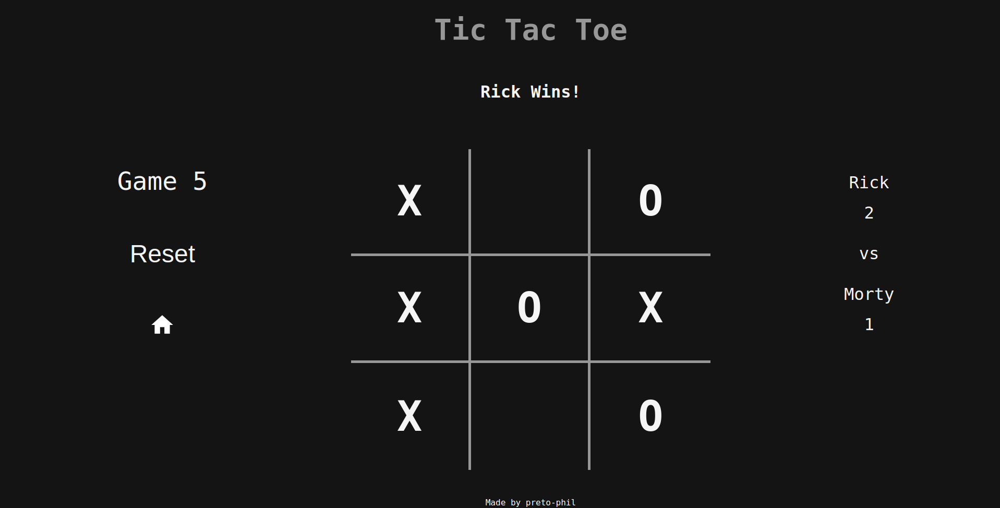

# Tic-Tac-Toe Project

## Overview

Welcome to my Tic-Tac-Toe project, completed as part of The Odin Project curriculum. This classic game is built using HTML, CSS, and JavaScript. In this README, I'll provide an overview of the project, its features, and the instructions for playing the game.

## Technologies Used

- HTML
- CSS
- JavaScript

## Project Features

- **HTML, CSS, and JavaScript**: This project utilizes the power of these three core web technologies to create an interactive Tic-Tac-Toe game.

- **Multiplayer and Single Player Modes**: The game supports both two-player and single-player modes. In single-player mode, you can play against the computer.

- **Game Logic**: The game's logic is encapsulated within objects, including the Gameboard, Player, and Game objects. This modular approach minimizes global code and enhances code organization.

- **Dynamic Rendering**: JavaScript functions render the gameboard array onto the webpage, allowing players to visualize and interact with the game.

- **Player Interaction**: Players can click on the gameboard to place their markers (X or O). The logic prevents players from playing in spots that are already taken, ensuring a fair game.

- **Winning Conditions**: The game checks for winning conditions, including 3-in-a-row and a tie. When a player wins or the game ends in a tie, a display element congratulates the winning player or announces the tie.

## What I've Learned

- During this project, I gained valuable experience in using HTML, CSS, and JavaScript to create an interactive web application.

- I improved my understanding of modular programming by encapsulating game logic within objects, resulting in cleaner and more maintainable code.

- I enhanced my problem-solving skills by implementing various DOM manipulation.

## Future Improvements

- Implement the minimax algorithm to create an unbeatable computer opponent in single-player mode.

- Add sound effects and animations to make the game more engaging.

- Improve the user interface and overall design for a more polished look and more responsiveness.

- Optimize the code for better performance and compatibility across various devices and browsers.

- Refactor code to minimize coupling and duplication.
